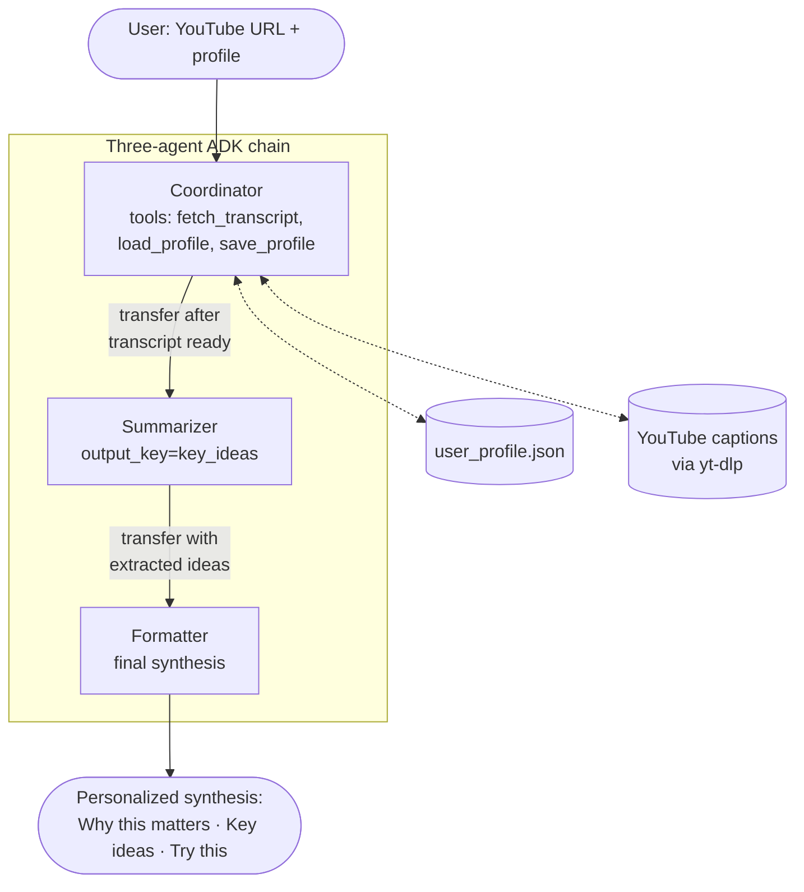

# nova-adk-agent

Porting capabilities from Nova — a personal multi-agent system running on Claude
Code — to Google's [Agent Development Kit](https://github.com/google/adk-python).

A four-week public build targeting gen-AI backend roles. Daily commits. One
LinkedIn post per week pointing at the repo state at the end of that week.

## What it does

Give the agent a YouTube podcast URL and your profile. It fetches the
transcript, extracts the 3-5 ideas that matter *to you*, and writes a
personalized synthesis — not a generic summary.

## Architecture



Three stages, each with a narrow job:

1. **Coordinator** — collects/persists the user profile, fetches the transcript,
   hands off.
2. **Summarizer** — extracts 3-5 key ideas in the user's vocabulary.
3. **Formatter** — produces the final structured synthesis (*Why this matters ·
   Key ideas · Try this*).

Built on ADK's transfer pattern (`sub_agents` + `disallow_transfer_to_parent`) —
the chain flows forward only, each agent owns one narrow job.

## Stack

- Python 3.11+
- [`google-adk`](https://pypi.org/project/google-adk/) — Agent Development Kit
- Gemini 2.5 Flash via the Gemini API (Vertex AI config stubbed for Week 2)
- `yt-dlp` for transcript fetching (caption API preferred, VTT fallback)

## Quick start

```bash
git clone https://github.com/smist37/nova-adk-agent.git
cd nova-adk-agent

python3 -m venv .venv
source .venv/bin/activate
pip install -r requirements.txt

cp .env.example .env
# edit .env — set GOOGLE_API_KEY (get one at https://aistudio.google.com/apikey)

# Three-agent podcast synthesizer (main entry point)
python -m nova_adk_agent

# Or the single-agent MVP
python -m nova_adk_agent.summarize

# Or the hello-world agent
python -m nova_adk_agent.hello
```

A smoketest script lives at [`scripts/smoketest.sh`](scripts/smoketest.sh) —
`bash scripts/smoketest.sh` runs the clone-install-import path end to end.

## Example session

```
$ python -m nova_adk_agent
Nova podcast synthesizer. Share a YouTube URL to get started. Ctrl-C to exit.

you> https://www.youtube.com/watch?v=<episode-id>
agent> I don't have a profile for you yet. What's your name, your role,
       your interests, and what you typically want out of podcast episodes?

you> Miles. Staff engineer, cleared work. Interests: LLMs, agent systems,
     federal gen AI. I want concrete patterns I can apply, not vibes.
agent> Saved. Fetching transcript...
agent> [transfer → summarizer → formatter]

**Why this matters to you**
The episode's claim — that eval is the gap between a demo and a product —
lines up with the Week 2 eval harness you're building. The guest's routing
argument (cheap models for easy queries) is the exact cost-density point
you'd defend in a federal deployment review.

**Key ideas**
- Infrastructure scope is inversely correlated with shipping speed.
- Lightweight online eval + a handful of trusted offline tests beats
  either approach alone.
- Cost becomes a first-class constraint the moment user count flips;
  teams that treat it as one from day one win the second half.
- Model routing cuts 60-70% of inference cost at equivalent quality.

**Try this**
Pick one agent call in the repo and route it through gemini-2.5-flash-lite
instead of gemini-2.5-flash. Log cost and eval score side by side.
```

## Tests

```bash
# Wire-up tests (no LLM calls, fast, safe for CI)
python -m pytest tests/ -v

# End-to-end eval harness (hits Gemini API, costs a few cents)
python -m eval.run
```

See [`eval/README.md`](eval/README.md) for the eval harness (RAGAS-based) and
[`docs/DEPLOY.md`](docs/DEPLOY.md) for the Vertex AI deploy wiring.

## Roadmap

- **Week 1** — ADK scaffold, single-agent summarizer, three-agent chain, README.
- **Week 2** — Vertex AI deploy wiring + RAGAS eval harness.
- **Week 3** — A2A multi-agent demo, clone-and-run smoketest.
- **Week 4** — Technical write-up.

Stretch: [CI](.github/workflows/eval.yml),
[A2A-MCP bridge](docs/A2A-MCP-BRIDGE.md),
[open-weight fallback](docs/OPEN-WEIGHT-FALLBACK.md),
[security variant](docs/SECURITY-VARIANT.md).

## Status

- [x] Repo created
- [x] Hello-world ADK agent
- [x] Podcast summarizer single-agent MVP
- [x] Multi-agent orchestration (Coordinator → Summarizer → Formatter)
- [x] README architecture diagram + learnings
- [x] LinkedIn post drafts ([week 1](docs/posts/week1-draft.md))
- [ ] Vertex AI deploy (wired, not deployed)

## License

MIT. Build on it, fork it, steal the patterns.
